# Lab #8 — Infraestructure as Code with Terraform (Azure)
**Course:** ARSW  
**Author:** Daniel Patiño Mejia

## Purpose
To modernize the Azure load balancing lab using Terraform to define, provision, and version the infrastructure. The goal is for students to design and deploy a reproducible, secure architecture that adheres to Infrastructure as a Community (IaC) best practices.

## Learning Objectives
1. Model Azure infrastructure with Terraform (providers, state, modules, and variables).

2. Deploy a high-availability architecture with a Load Balancer (L4) and 2+ Linux VMs.

3. Implement basic security hardening: NSG, SSH with a key, tags, and naming conventions.

4. Integrate a remote backend for the state in Azure Storage using state locking.

5. Automate plan/apply actions from GitHub Actions using OIDC authentication (without long secrets). 6. Validate operation (health probe, test page), monitor costs, and securely delete.

---

## Target Architecture
- **Resource Group** (e.g., `rg-lab8-<alias>`)
- **Virtual Network** with 2 subnets:

- `subnet-web`: VMs behind the **Azure Load Balancer (public)**

- `subnet-mgmt`: Bastion or hop (optional)
- **Network Security Group**: only allows **80/TCP** (HTTP) from the Internet to the Load Balancer and **22/TCP** (SSH) only from your public IP address.

- - Public **Load Balancer**:
  - Frontend public IP
  - Backend pool with 2+ VMs
  - **Health probe** (TCP/80 or HTTP)
  - **Load balancing rule** (80 → 80)
- **2+ Linux VMs** (Ubuntu LTS) with cloud-init/Custom Script Extension to install **nginx** and serve a page with **hostname**.
- **Azure Storage Account + Container** for Terraform **remote state** (with lock).
- **Tags**: `owner`, `course`, `env`, `expires`.

---

## Prerequisites
- Azure account/subscription (Azure for Students or equivalent).

- **Azure CLI** (`az`) and **Terraform >= 1.6** installed on your computer.

- Generated **SSH key** (e.g., `ssh-keygen -t ed25519`).

- **GitHub** account to run the Actions pipeline.

---

## Suggested Repository Structure
```

```` ├─ below/
│ ├─ main.tf
│ ├─ providers.tf
│ ├─ variables.tf
│ ├─ outputs.tf
│ ├─ backend.hcl.example
│ ├─ cloud-init.yaml
│ └─ send/
│ ├─ dev.tfvars
│ └─ prod.tfvars (optional)
├─ modules/
│ ├─ vnet/
│ │ ├─ main.tf
│ │ ├─ variables.tf
│ │ └─ outputs.tf
│ ├─ compute/
│ │ ├─ main.tf
│ │ ├─ variables.tf
│ │ └─ outputs.tf
│ └─ lb/
│ ├─ main.tf
│ ├─ variables.tf
│ └─ outputs.tf
└─ .github/workflows/terraform.yml
```

---
## Bootstrap for the remote backend
First, we create the **Resource Group**, **Storage Account**, and **Container** for the _state_:


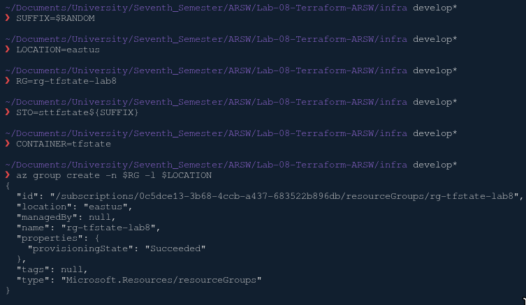

This step encountered some problems because Microsoft.Storage was not registered as a provider for our Azure account, so we had to log in and enter the following commands:

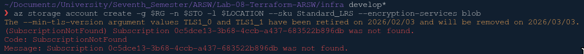

Login
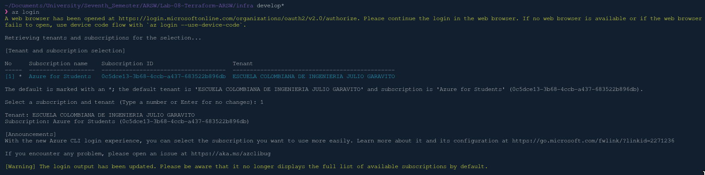

Check and register:
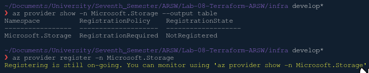

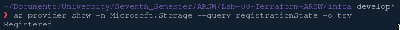

After that, we tried entering the commands again:

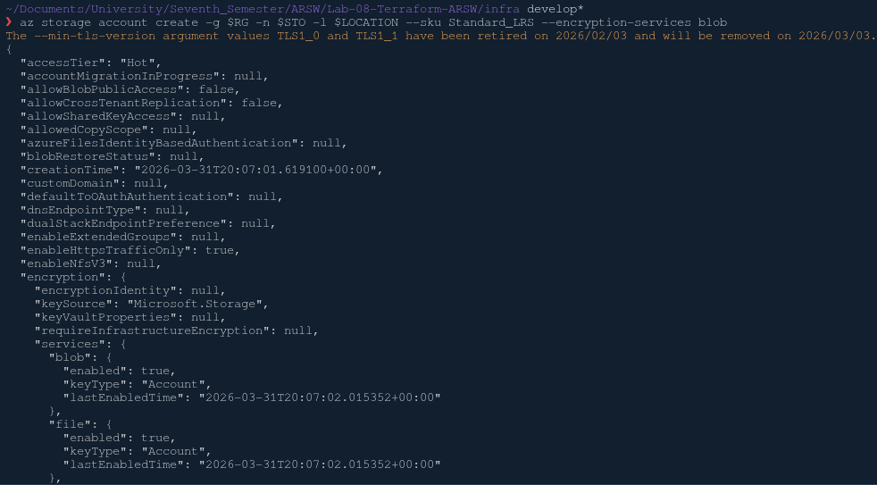
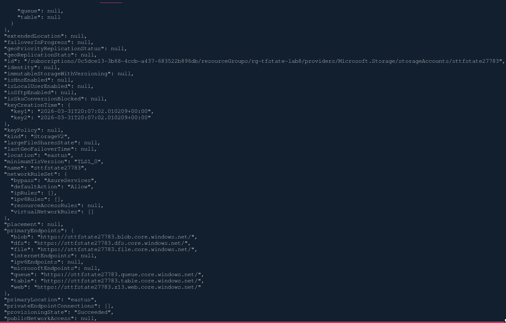
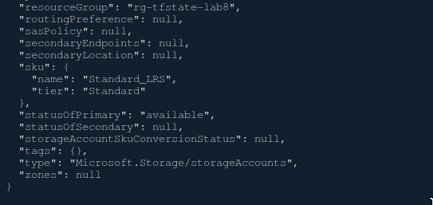

As we can see, it is created correctly. We continue entering the commands.

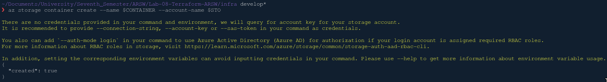

Finally, we complete `infra/backend.hcl.example` with the created values ​​and rename it to `backend.hcl`.

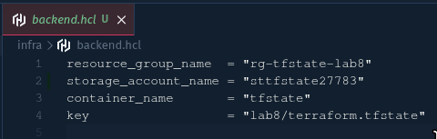

---

## Main Variables

In `infra/env/dev.tfvars` we modify the file with our data:

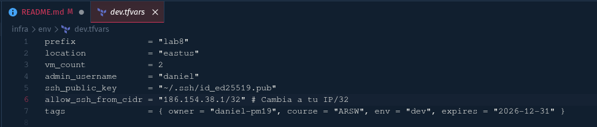

---

## Local Work Flux

We start following the next steps:
```bash
cd infra

# Azure Authentication
az login
az account show 
```


```bash
# Initialize Terraform with remote backend
terraform init -backend-config=backend.hcl
```

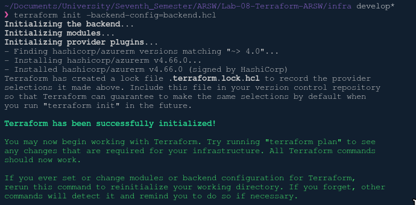

```bash
# Quick review
terraform fmt -recursive
terraform validate
```

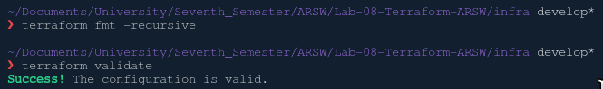

```bash
# Plan with dev variables
terraform plan -var-file=env/dev.tfvars -out plan.tfplan
```

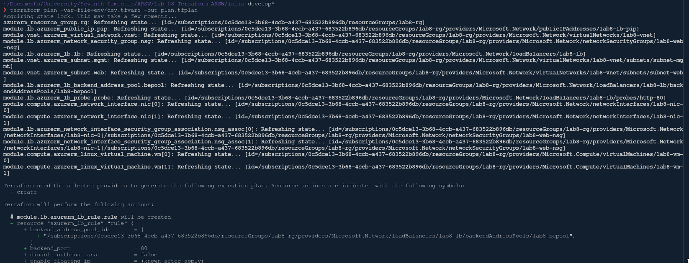
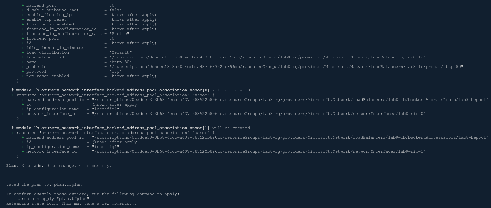

```bash
#Apply
terraform apply "plan.tfplan"
```

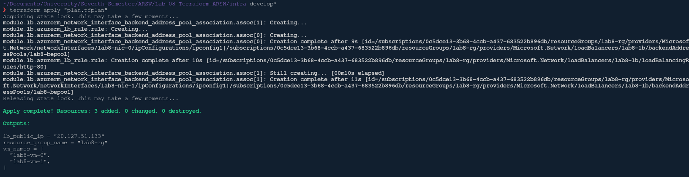

```bash
# Check the public LB (change to your IP)
curl http://$(terraform output -raw lb_public_ip)
```

**Expected outputs** (example):
- `lb_public_ip`
- `resource_group_name`
- `vm_names`

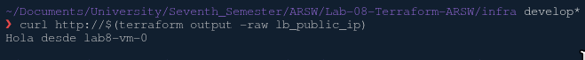


---

## GitHub Actions (CI/CD con OIDC)

For this part, we created the YAML file with the workflow; however, we couldn't proceed further because we lacked permissions to access the App Registrations functions. Nevertheless, we created the secrets on GitHub and uploaded the .yml file.

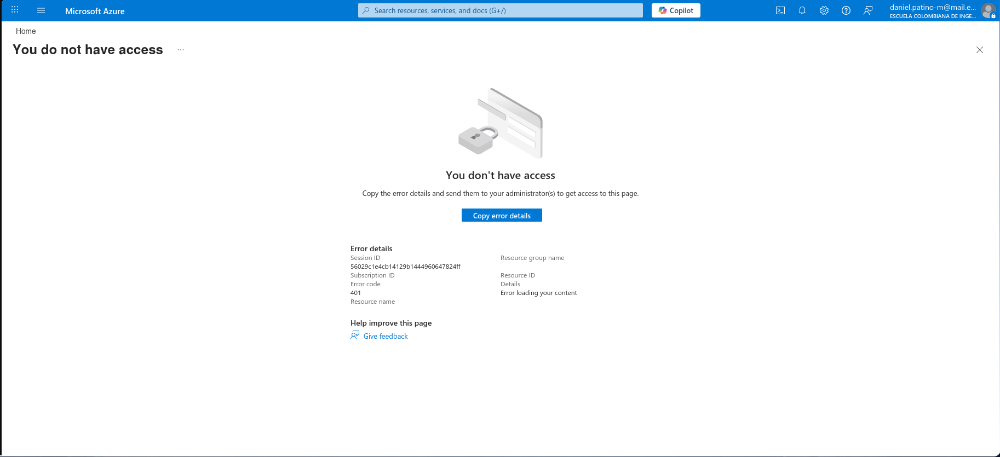

---

## Cleaning

After performing the procedure, we clean up the terraform using the following command:

```bash
terraform destroy -var-file=env/dev.tfvars
```

## Reflection Questions
- Why use an L4 LB instead of an L7 Application Gateway in your case? What would change?

- A: An L4 LB is used instead of an L7 because it operates at the transport layer and doesn't parse HTTP content. This means it's simpler and more economical than an application-layer LB, and for the lab, it's more than sufficient since we only need to distribute HTTP traffic. It's also less complex to configure. In contrast, an L7 LB operates at the application layer, allowing for URL-based routing, TLS termination, and greater protection against cyberattacks. Ideally, it would be used when there are multiple applications behind the LB, requiring advanced security and intelligent routing.

- What are the security implications of exposing 22/TCP? How can these be mitigated?

  Risks:
  - Brute-force attacks
  - Automated bot scanning
  - Unauthorized access attempts
  - Potential exploitation of system vulnerabilities

  How to mitigate them?
  - Restrict access to a single IP address
  - Authenticate via SSH
  - Use a VPN or a private network
  - Monitor and log access
  - Disable password and root login

- What improvements would you make if this were in **production**? (resilience, autoscaling, observability).

  Resilience
  - Distribute VMs across multiple zones
  - More robust health probes (HTTP and TCP)
  - Implement automatic failover
  - VM backups and snapshots

  Autoscaling
  - Replace VMs with VM Scale Sets (VMSS)
  - Configure CPU/request scaling and automatic scaling
  - Integration with Load Balancers or Application Gateways

  Observability
  - Azure Monitor + Log Analytics
  - Centralized logs
  - Alerts
  - Dashboards (Azure Dashboard)